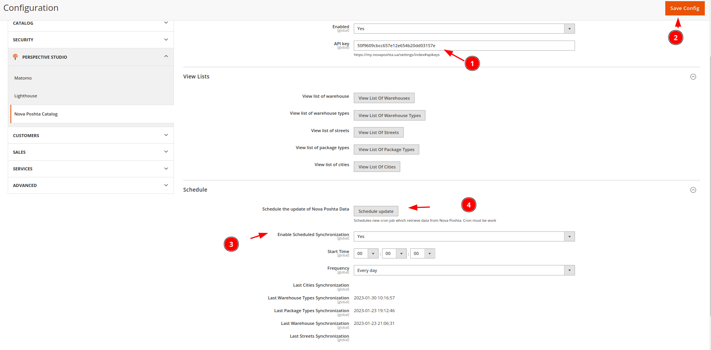

## Perspective Novaposhta Catalog 

### Install this package use the following steps:

1. Go to Magento 2 root directory.  
   1. For Magento 2 (from 2.4.5+) and direct installation from B use following command enter the following commands:  
       ```
       composer require perspectiveteam/module-novaposhtacatalog:"*"  
       ```
2. Wait while all dependencies are update. 
3. Make an ordinary setup for the module
   
   1. Add API key to the module configuration
   2. Save Configuration
   3. Enable cron jobs for the module
   4. You can manually schedule cron jobs for the module

